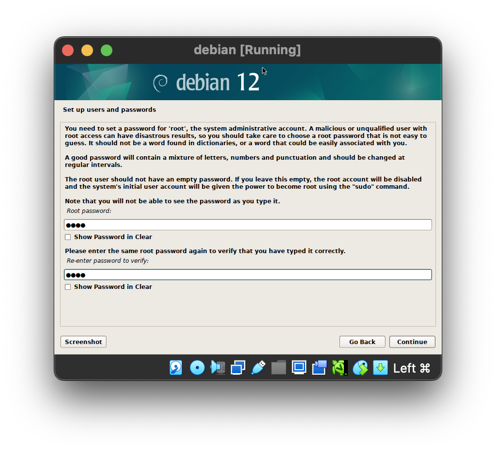

# Create a VM in VirtualBox

## Summary

Before we even get started learning, we probably need to have a real Linux machine to work on.
Because while macOS is a Unix like system, and it's very similar to Linux in a lot of ways, there are
still a few differences.

To get a real Linux machine without actually needing to buy a server, we'll use something called a 
`hypervisor`. In a nutshell a hypervisor is a piece of software that produces `virtual computers`, by
emulating all its hardware components, like the memory, the disks, the motherboard, a screen, and so on.

The aforementioned virtual computers are most commonly called `virtual machines`, and they are built
in such a way that each virtual machine believes it's a real computer on its own, it has no idea that the
hypervisor exists, but really it's just another process on the hypervisor.

There are different types of hypervisors with different purposes, but for our use case we'll use
`VirtualBox`, which is a `type 2` hypervisor. Type 2 just means that simply an application on your machine
So it just runs like any other app, and because of that, it's relatively simple to set up and use.

It's not very relevant to our discussion right now, but probably still important to know that hypervisor
technologies are at the core of what people call `the cloud`. Platform like AWS, and GCP offer virtual machines
as a service, and all the intricacies of what happens under the hood are hidden to the end users.
But the core technologies really just are virtual machines and hypervisors. Typically, in the cloud, or in enterprise
systems, the hypervisors used would be `type 1` those systems are also sometimes referred to as `Bare Metal`
hypervisors, and while they are slightly more complex to configure they offer better performance.

## Install VirtualBox

We are using a mac sporting an `Apple Silicon` Chip, so the `instruction set` is `arm64`. This is just fancy talk to say
that we're using a cool new type of `CPU`, but we need to know that to choose the right versions for the components
we're about to download, you can think about it like engines. Lets say if an `intel based` engine needs diesel fuel,
an `arm64` engine runs on petrol, we need to make sure we give it the right thing.

First we'll install Virtual Box from their download page - [https://www.virtualbox.org/wiki/Downloads](https://www.virtualbox.org/wiki/Downloads)
And we're choosing the Apple Silicon type of fuel.

## Download a Debian ISO

Ok, now we also need an install disk for `Debian`, again we need it to be the Apple Silicon type of fuel we can download it from here:
[https://cdimage.debian.org/debian-cd/current/arm64/iso-cd/](https://cdimage.debian.org/debian-cd/current/arm64/iso-cd/)

Note that the file names says `arm64`, that's how we know we got the right one.

## Configure the Virtual Machine

In the VirtualBox app we'll click new, and configure the desired name of the vm as well as the path
to the ISO image we downloaded, we'll also skip the unattended install, because we want to learn how
to do this ourselves, we can then just click next on all the subsequent windows. Simply note that
we are choosing how much disk, memory, cpu and so on we would like to emulate, but the defaults are fine

Ok we're done defining what the virtual machine should look like, now we have a virtual machine in stopped
state, with an install disk in its drive bay. Let's power it up and see what happens.

## Install Debian

This happened very quick but the UEFI started the grub bootloader on the cdrom, which gives us a few options
We want to do the graphical installation.

We're then in the graphical installation wizard for Debian, we can just follow the prompt, they are all very self-explanatory, we do things like choosing the language, the region, the keyboard layout and so on. Choose to
your heart's contempt, or leave the default settings if you aren't sure until you're asked to choose the
root password, if this was a production system, of course it would be important here to choose a safe password,
but we're just testing here, and we have problems respecting rules, so we're just going to use root:root.

After that we'll be asked to choose a non-root username, I'll just call it chee, password chee, and continue with
the defaults until we're asked how we want to partition the disks, we'll choose guided partitioning and there
will be LVM references here, this should sound familiar. But for the sake of simplicity we'll choose to use the entire
disk without LVM, all files in one partition, and we confirm that yes, we agree to write the changes to disk.

Now the install disk is actually copying files into the virtual drive, effectively installing Linux on disk.
We can just keep going with the defaults until we're asked to choose what desktop environment we want, this is
what's going to define the look and feel of the system, there are many option here, but we'll just choose the default
debian experience and continue.

Keep choosing the default values until the Installer is done and asks us to reboot.

## First Boot

Once the box has rebooted, we are faced with a `grub` again but as you can see it looks
different from the first time we saw it. That's because the first one was the grub of the
installation media itself, and it was running directly from the cdrom.
This time we're looking at the grub of the brand new debian system we just installed on
disk. Why did it not just boot directly on the disk again you may ask? Because the debian
installer intelligently sent an eject disk instruction to VirtualBox and
unmounted the cdrom automatically for us, see the greyed out cdrom in the status bar.
But with a different os if we may have needed to remove the cdrom from the reader or
change the boot order in the bios/uefi to avoid booting forever on the cdrom.

Anyway we see grub, and as we know grub is a `bootloader` 🥾, and a bootloader's purpose
is to be and entrypoint for the `bios/uefi`, and a launchpad for linux 🚀.
So let's launch debian and see what happens. The green ok list here is systemd,
this is our system and service manager, and it's currently `bootstraping` our
Linux `Debian` OS, initialising things like the network, drivers, multi-user target
graphical target and much more.

When it's done, it will leave us at the login page for the unprivileged user we
created during the installation. So we can just log in with the password we chose

And ta-da! We have created our first linux virtual machine.

## Conclusion and recap

Now while this article showed how to create: 
- A vm with a `Debian` OS, on a `VirtualBox` hypervisor, on an `AppleSilicon` architecture

We could change any of those 3 variables, the concepts remain largely the same, for instance,
we could build:
- A vm with a `Centos` OS, on a `VirtualBox` hypervisor, on an `AppleSilicon` architecture
- A vm with a `RedHat` OS, on a `KVM` hypervisor, on an `Intel x86` architecture
- A vm with a `Ubuntu` OS, on a `ESXi` hypervisor, on an `MIPS` architecture
 
In fact, we just need to remain attentive to not try to install an OS or a hypervisor on
the wrong CPU architecture, but otherwise the concepts are always the same:
1. Have a physical machine and be aware of its CPU architecture
2. Install a hypervisor on it with the corresponding CPU architecture
3. Find an installation media for the OS we want to virtualize (same CPU architecture)
4. Create a VM in the hypervisor, and mount the installation media to it
5. Make sure the bios or uefi boots on the installation media
6. Follow the installer's on screen instruction until the os is installed on disk
7. Remove the installation media and reboot, or force the bios/uefi to boot on disk
8. You're done just watch the following process unfold on boot: bios/uefi > grub > systemd > login 